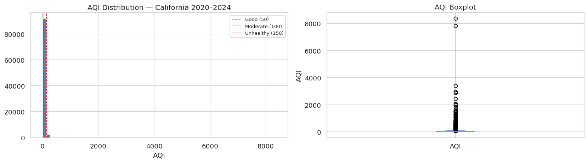
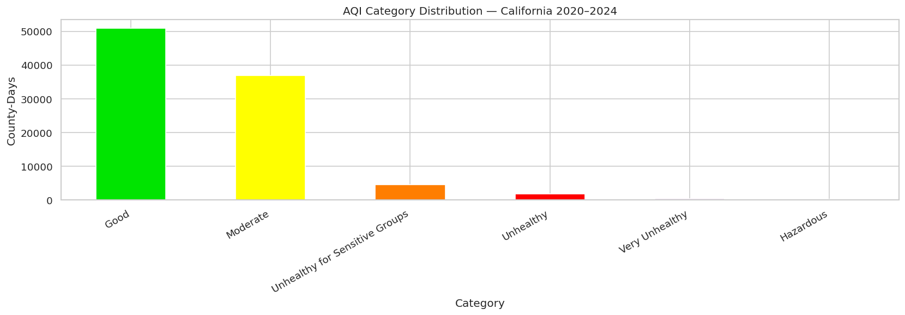
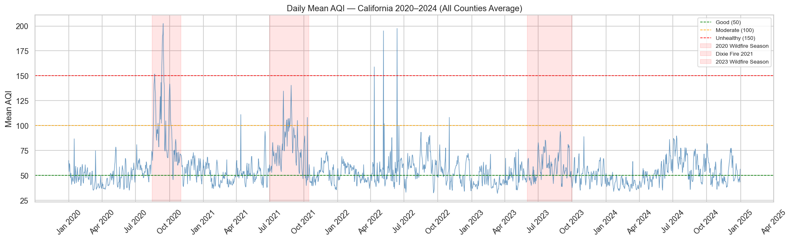
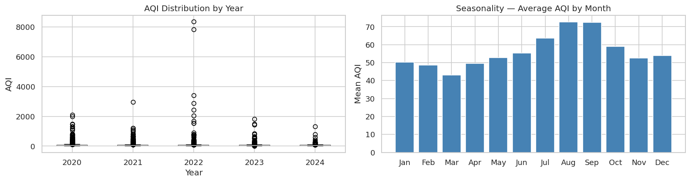
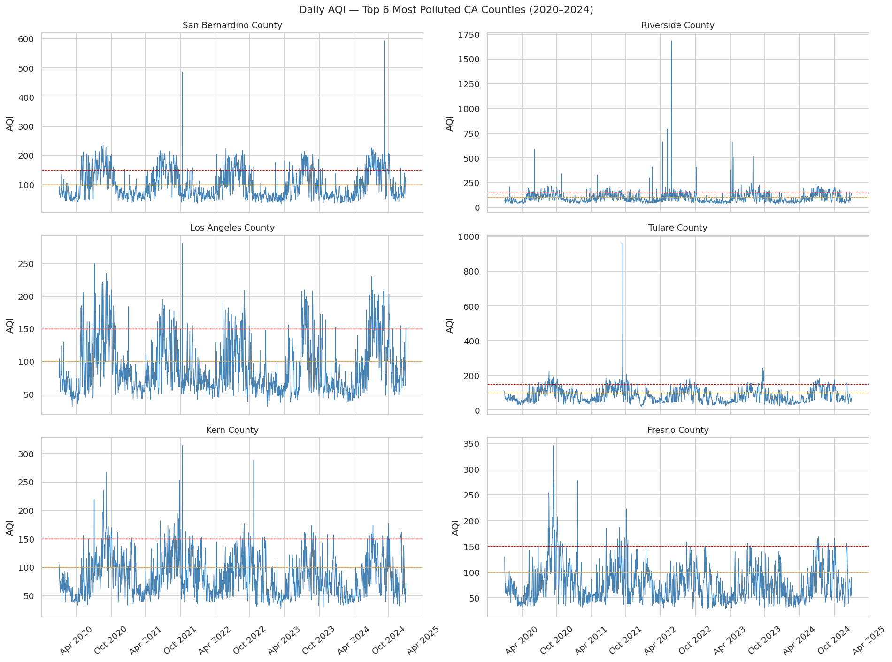
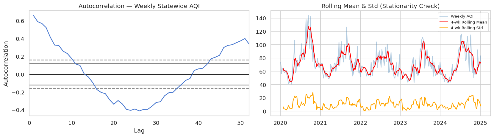
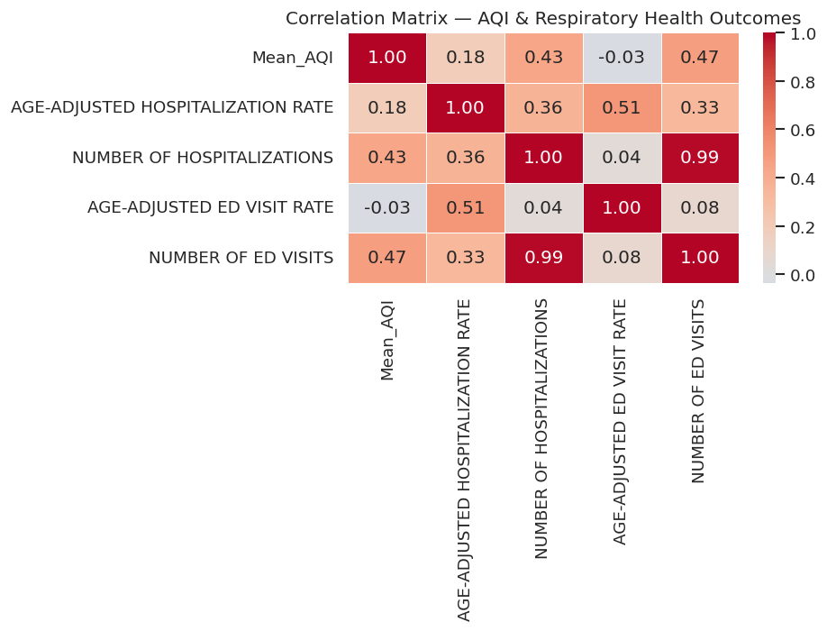
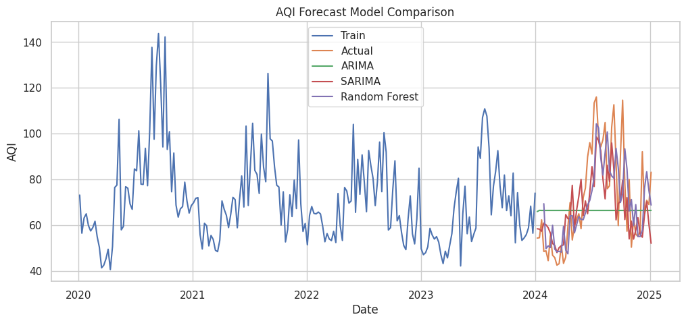
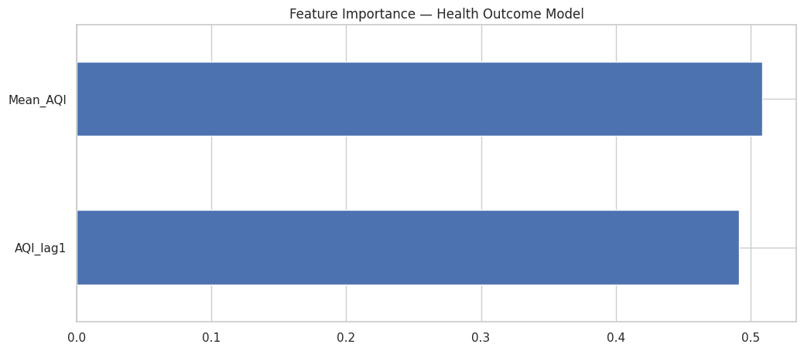

# Air Quality Prediction and Respiratory Health Impact Modeling in California (2020–2024)

## Overview

This project analyzes air quality trends across California and models their relationship with respiratory health outcomes. By integrating EPA air quality data with California public health records, we develop predictive models to forecast AQI and assess its impact on asthma-related hospitalizations and emergency department visits.

**Team:** Alli McKernan, Paola Rodriguez, Vinh Dao

---

## Objectives

- Forecast future population-weighted statewide AQI using time-series models
- Quantify the lagged impact of air pollution on asthma-related health outcomes
- Compare statistical and machine learning approaches
- Provide insights for public health and policy decision-making

---

## Data Sources

| Source | Description |
|--------|-------------|
| [EPA Air Quality System (AQS)](https://www.epa.gov/aqs) | Daily county-level AQI data (2020–2024) |
| [California Dept. of Public Health (CDPH)](https://www.cdph.ca.gov/) | Asthma hospitalization and ED visit rates by county |

> **Note:** Raw EPA AQS files ( for 2020–2024) must be downloaded separately from the EPA AQS website and placed in . All other data files are included in this repository.

---

## Repository Structure

```
Air-Quality-Prediction-and-Respiratory-Health-Impact-Modeling-in-California-2020-2024-/
|
+-- data/
|   +-- aqs/                          # Raw EPA AQS daily CSVs (download separately)
|   +-- asthma_hosp_by_county.csv     # Raw CDPH hospitalization data
|   +-- asthma_ed_by_county.csv       # Raw CDPH ED visit data
|   +-- asthma_hosp_clean.csv         # Cleaned hospitalization data (generated)
|   +-- asthma_ed_clean.csv           # Cleaned ED visit data (generated)
|   +-- weekly_statewide_aqi.csv      # Population-weighted weekly AQI (generated)
|   +-- weekly_county_aqi.csv         # Weekly AQI by county (generated)
|   +-- annual_county_aqi.csv         # Annual mean AQI by county (generated)
|   +-- joint_aqi_health_county.csv   # Merged AQI + health dataset (generated)
|   +-- aqi_forecast_results.csv      # AQI model forecasts (generated)
|   +-- aqi_model_metrics.csv         # AQI model evaluation metrics (generated)
|   +-- health_model_metrics.csv      # Health model evaluation metrics (generated)
|   +-- health_model_predictions.csv  # Health model predictions (generated)
|
+-- notebooks/
|   +-- 01_eda.ipynb                  # Data loading, cleaning, EDA
|   +-- 02_modeling.ipynb             # Time-series forecasting + health impact models
|
+-- src/
|   +-- data_preprocessing.py         # Load, filter, and aggregate AQS/CDPH data
|   +-- feature_engineering.py        # Lag features and county encoding
|   +-- modeling.py                   # ARIMA, SARIMA, RF, and regression models
|   +-- evaluation.py                 # MAE, RMSE, R2 metric helpers
|   +-- visualization.py              # Reusable plotting functions
|
+-- app/
|   +-- app.py                        # Streamlit interactive dashboard
|
+-- images/
|   +-- daily_mean_aqi.png
|   +-- forecast_model_comparison.png
|   +-- feature_importance.png
|   +-- aqidistribution.png
|   +-- aqicategorydistribution.png
|   +-- aqidistyear.png
|   +-- top6.png
|   +-- weeklystatewide.png
|   +-- correlation.png
|
+-- requirements.txt
+-- README.md
```

---

## How to Run

### Option 1 (Recommended): Run in GitHub Codespaces

This project can be run entirely in the cloud using GitHub Codespaces—no local setup required.

#### Steps:

1. Open the repository on GitHub  
2. Click the green **“Code”** button  
3. Select the **“Codespaces”** tab  
4. Click **“Create codespace on main”**

Once the environment loads:

### 1. Install dependencies
```bash
pip install -r requirements.txt
```

### 2. Run the notebooks 
Do not launch Jupyter from the terminal.

Instead:
1. Open the left sidebar (Explorer)
2. Navigate to:
```bash
notebooks/
```
3. Click and run the notebooks in order:

01_eda.ipynb → Data cleaning and preprocessing (generates datasets)

02_modeling.ipynb → Forecasting and health impact models

If prompted, select the default Python 3 kernel.

### 3. Launch the interactive dashboard
In the terminal, run:
```bash
python -m streamlit run app/app.py
```
Then open the forwarded port from the “Ports” tab in Codespaces.

### Option 2: Run Locally
Prerequisites:
Python 3.12+
EPA AQS data files (see Data Sources above)

### 1. Clone the repository
```bash
git clone https://github.com/alligmckernan/Air-Quality-Prediction-and-Respiratory-Health-Impact-Modeling-in-California-2020-2024-.git
cd Air-Quality-Prediction-and-Respiratory-Health-Impact-Modeling-in-California-2020-2024-
```

### 2. Install dependencies
```bash
pip install -r requirements.txt
```

### 3. Run notebooks and dashboard
(Same steps as above)

---

## Modeling Approach

### Model 1 — AQI Forecast Model
Forecasts future population-weighted statewide AQI using weekly time-series data.

| Model | MAE | RMSE | R² |
|-------|-----|------|-----|
| ARIMA(1,1,1) | 17.74 | 21.69 | -0.046 |
| SARIMA(1,1,1)(1,1,1,52) | 12.20 | 16.05 | 0.428 |
| Random Forest (lag features) | 12.75 | 16.05 | 0.445 |

### Model 2 — Lagged Respiratory Health Impact Model
Predicts county-level asthma hospitalization and ED visit rates from lagged AQI exposure.

| Model | Hosp_MAE | Hosp_RMSE | Hosp_R² | ED_MAE | ED_RMSE | ED_R² |
|-------|-----|------|-----|------|-----|-----|
| Linear Regression | 0.6667 | 0.8327 | 0.1702 | 6.9787 | 7.7779 | 0.2444 |
| Random Forest | 0.6781 | 0.8104 | 0.2142 | 7.6750 | 9.0469 | -0.0223 |
| Gradient Boosting | 0.5896 | 0.6957 | 0.4209 | 7.1512 | 9.1319 | -0.0416 |

---

## Visualizations

**AQI Distribution - California 2020-2024**


**AQI Category Distribution**


**Daily Mean AQI (2020–2024)**


**AQI Distribution by Year**


**Daily AQI - Top 6 Most Polluted CA Counties**


**Weekly Statewide AQI**


**Correlation Matrix - AQI & Respiratory Health Outcomes**


**AQI Forecast Model Comparison**


**Random Forest Feature Importance**


---

## Future Work

- Incorporate wildfire smoke and weather variables
- Expand health outcome targets (COPD, cardiovascular)
- Improve county-level spatial modeling
